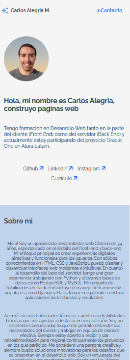

# Portafolio de Carlos Alegria

## Descripción

¡Bienvenido a mi portafolio! Este repositorio contiene el código fuente de mi portafolio personal, donde muestro algunos de los proyectos en los que he trabajado, así como mi experiencia y habilidades como desarrollador web.

## Tecnologías Utilizadas

-  HTML5
-  CSS3
-  JavaScript

## Contenido

- Proyectos: Aquí encontrarás carpetas individuales para cada uno de los proyectos que he desarrollado. Cada carpeta contiene el código fuente y una breve descripción del proyecto.

- Experiencia: En esta sección, proporciono información sobre mi experiencia laboral y educativa relacionada con el desarrollo web.

- Habilidades: Enumero las tecnologías y herramientas que domino como desarrollador web, desde lenguajes de programación hasta frameworks y bibliotecas.

- Contacto: Si deseas ponerte en contacto conmigo para colaboraciones o cualquier otra consulta, encontrarás mis datos de contacto en esta sección.

## Capturas de pantalla

